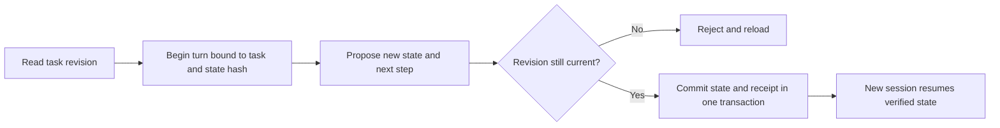

# A task that survives the next session

A working, synthetic example extracted from the design of a personal agent
system. It is newly written demonstration code, not a copy of its deployed
memory store. Python 3.10+ and the standard library are sufficient.

From the repository root:

```sh
make demo
make test
```

The demo saves a fictional release-notes task, opens a new session, resumes
the task, and rejects a stale competing update and a mismatched task token.
It uses an automatically removed temporary directory. No model or account is
required, and it sends nothing.

## The mechanism



An exact retry returns its original receipt. A retry with changed content is
rejected. Two writers cannot both advance the same revision. If recording the
receipt fails, the state write rolls back as well.

`test_continuity.py` exercises competing writers, transaction rollback, replay,
task/version mismatches, and unrecorded state changes. The private system uses
scoped Git transactions and topic files; SQLite keeps this example portable
and makes the atomic boundary explicit.

## What this does not prove

- A matching hash proves byte identity, not factual truth or good judgment.
- Turn tokens correlate work; they do not authenticate a person or an agent.
- The database is a trusted local boundary. Someone who can rewrite the whole
  database can rewrite both state and receipts. These are not signed audit logs.
- This is a single-machine example. It does not implement cross-host consensus,
  external delivery, or authorization to publish a result.
- A summary can still be wrong. Review of its meaning remains a separate step.
